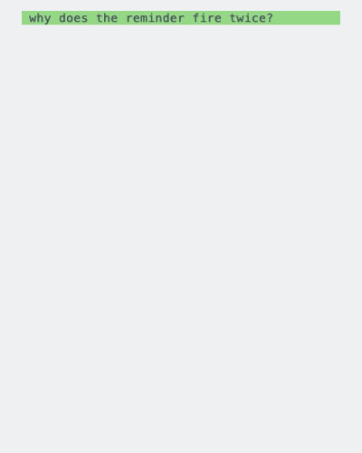
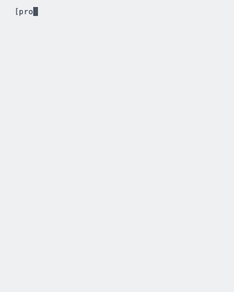

# unsolicited-text

What passes between a person and the agent: how a reply is formatted, the
english it is written in, the checklist before it is sent, and the ceiling
on its length. Nothing about the code or the instructions the agent writes.

The rules themselves are `AGENTS.md` at the root of this checkout. Any tool
that reads `AGENTS.md` natively already has them once the repository is on
disk. The plugin is what adds the hooks that hold a reply to them: a reminder
on every prompt, and a note at the end of a turn naming a reply that ran over
the ceiling.

## What changes

One ask, answered without the plugin and with it.

> the reminder fires twice on some prompts, why?

<table>
<tr>
<td align="center"><b>Without it</b></td>
<td align="center"><b>With it</b></td>
</tr>
<tr>
<td></td>
<td></td>
</tr>
</table>

Twenty-two lines of prose against six. The ceiling is eight, the queue does
not count against it, and what needs an answer is asked in one place.

## What is installed

| File | When it runs | What it does |
| --- | --- | --- |
| `hooks/load-agents-md.sh` | session start | prints `AGENTS.md` into the session |
| `hooks/remind-response-length.sh` | every prompt | restates the shortest-form rule |
| `hooks/replay-stop-notes.sh` | every prompt | prints the note the last turn recorded |
| `hooks/note-long-reply.sh` | turn end | records a note when the reply ran over the ceiling |

Every harness runs those same four scripts. Only the registration differs.

## Claude Code, ZCode

    claude plugin marketplace add justinkek/unsolicited-text
    claude plugin install unsolicited-text@unsolicited-text

In ZCode, add `justinkek/unsolicited-text` through Settings, Marketplace. It
preloads the Claude Code marketplace format and reads the same two manifests.

## Codex

    codex plugin marketplace add justinkek/unsolicited-text
    codex plugin add unsolicited-text@unsolicited-text

Codex does not run a plugin's own `hooks.json` yet
([openai/codex#16430](https://github.com/openai/codex/issues/16430)), checked on
codex-cli 0.144.5: the plugin installs and reports itself enabled, and a session
fires none of its hooks. Until that changes, register the same four commands by
hand in `~/.codex/config.toml`, which is the layer Codex does read:

    [[hooks.SessionStart]]
    [[hooks.SessionStart.hooks]]
    type = "command"
    command = "<path to this checkout>/hooks/load-agents-md.sh"

    [[hooks.UserPromptSubmit]]
    [[hooks.UserPromptSubmit.hooks]]
    type = "command"
    command = "<path to this checkout>/hooks/remind-response-length.sh"

    [[hooks.UserPromptSubmit.hooks]]
    type = "command"
    command = "<path to this checkout>/hooks/replay-stop-notes.sh"

    [[hooks.Stop]]
    [[hooks.Stop.hooks]]
    type = "command"
    command = "<path to this checkout>/hooks/note-long-reply.sh"

Codex asks you to trust each command the first time it meets it, and they stay
trusted until the command text changes. The session start hook prints the rules
into the session, so registering these four is all a Codex session needs - you
do not have to put the rules in `~/.codex/AGENTS.md` as well. Keep the plugin
installed alongside: when plugin hooks land, delete this block.

## Pi

    pi install git:github.com/justinkek/unsolicited-text

Pi cannot register a subprocess, so `harness-adapters/pi/src/index.ts` is a
shim: it builds the same line of JSON each script already reads on stdin,
spawns the script, and returns what it printed. It carries no rule of its own,
and it needs a shell on the machine, which the other three already require.

## Tests

    tests/run-tests

The two recordings are typed out from `demo/before.txt` and `demo/after.txt`.
Edit either one and record again:

    brew install vhs
    demo/record
