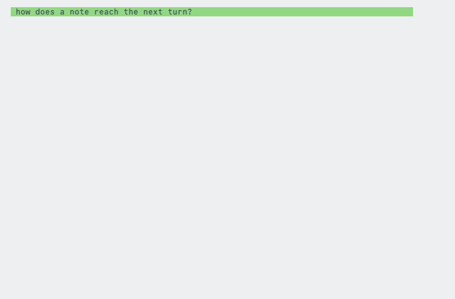
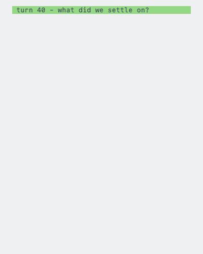
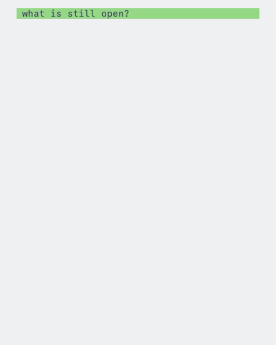

<p align="center">
  
</p>

<h2 align="center">"i did not consent to text"</h2>


## 1. Features

Responses are encouraged to keep to one thread at a time, and everything else gets added to the queue. 

<table>
<tr>
<td align="center"><b>Before</b></td>
<td align="center"><b>After</b></td>
</tr>
<tr>
<td></td>
<td></td>
</tr>
</table>

The queue holds different items (e.g. questions, investigations) which you can deal with one at a time when you feel necessary.

<details>
<summary><b>1.2. say less, see more</b></summary>

<table>
<tr>
<td align="center"><b>Before</b></td>
<td align="center"><b>After</b></td>
</tr>
<tr>
<td></td>
<td></td>
</tr>
</table>

<table>
<tr>
<td align="center"><b>Before</b></td>
<td align="center"><b>After</b></td>
</tr>
<tr>
<td></td>
<td></td>
</tr>
</table>

</details>

<details>
<summary><b>1.3. simple english</b></summary>

<table>
<tr>
<td align="center"><b>Before</b></td>
<td align="center"><b>After</b></td>
</tr>
<tr>
<td></td>
<td></td>
</tr>
</table>

</details>

<details>
<summary><b>1.4. single sentence confirmations</b></summary>

<table>
<tr>
<td align="center"><b>Before</b></td>
<td align="center"><b>After</b></td>
</tr>
<tr>
<td></td>
<td></td>
</tr>
</table>

I don't need to hear your life story after asking you to do something.

</details>

<details>
<summary><b>1.5. no agent drift</b></summary>

The agent remains concise even with longer sessions via skills, hooks and local state.

<table>
<tr>
<td align="center"><b>Before</b></td>
<td align="center"><b>After</b></td>
</tr>
<tr>
<td></td>
<td></td>
</tr>
</table>

</details>

## 2. Settings

Everything a hook reads is a setting, and two skills come with the plugin to
reach them. Neither costs a session more than its own name until you use it.

| Skill                       | What it does                                     |
| --------------------------- | ------------------------------------------------ |
| `unsolicited-text:settings` | says what is set, and changes one setting        |
| `unsolicited-text:update`   | updates the plugin, whichever harness you are in |


<details>
<summary><b>2.1 configure as much of the queue as you want to see</b></summary>

<table>
<tr>
<td align="center"><b>Before</b></td>
<td align="center"><b>After</b></td>
</tr>
<tr>
<td></td>
<td></td>
</tr>
</table>

</details>

<details>
<summary><b>2.2 open each queue item with an emoji</b></summary>

<table>
<tr>
<td align="center"><b>Before</b></td>
<td align="center"><b>After</b></td>
</tr>
<tr>
<td></td>
<td></td>
</tr>
</table>

Off unless you ask for it: a terminal with no emoji font shows a box instead.

</details>

## 3. Install

Copy/paste into your CLI prompt:

```text
Install the unsolicited-text plugin from https://github.com/justinkek/unsolicited-text, refer to the repo's INSTALL.md for instructions.
```

Or 🔗 [check the installation instructions](INSTALL.md).

## 4. How it works

| File                              | When it runs  | What it does                                                             | Tokens                                   |
| --------------------------------- | ------------- | ------------------------------------------------------------------------ | ---------------------------------------- |
| `hooks/load-rules.sh`         | session start | prints `rules/reply-shape.md` into the session                                      | ~2,300                                   |
| `hooks/remind-response-length.sh` | every prompt  | restates the shortest-form rule                                          | ~50                                      |
| `hooks/replay-stop-notes.sh`      | every prompt  | prints the note the last turn recorded                                   | ~70, and only when there is one          |
| `hooks/note-long-reply.sh`        | turn end      | records a note when the reply ran over the ceiling                       | none, it prints nothing into the session |
| `hooks/note-long-queue.sh`        | turn end      | records a note when the queue showed more items than allowed             | none, it prints nothing into the session |
| `hooks/note-new-version.sh`       | session start | asks once a day whether a newer version is out, and prints what it found | ~30, and only when there is one          |

(Estimated at four characters to a token)

## 5. Tests

    tests/run-tests

Each pair is typed out from `demo/<name>.prompt`, `demo/<name>-before.txt` and
`demo/<name>-after.txt`. Edit any of them and record again:

    brew install vhs
    demo/record

## 6. Docs
The logo is drawn in `logo/logo.svg` and rendered by `logo/render`.

They are typed in Commit Mono at the palette in `demo/record`. Without that face installed the recording falls back to another one, and `demo/record` says so before it starts.
