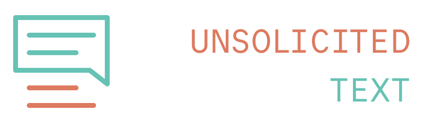
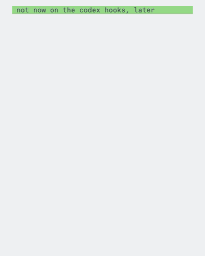
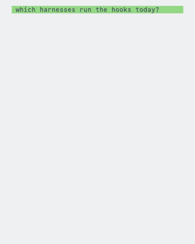
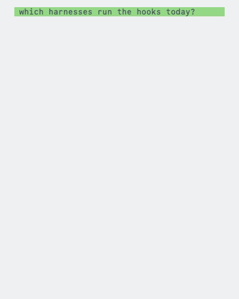

  

<i>Consent is important.</i>

## What changes

### Answer in eight lines, and list what is open

Seventeen lines of prose against six. The ceiling is eight, the queue does not
count against it, and everything still open is listed in one place rather than
asked inside the answer.

<table>
<tr>
<td align="center"><b>Before</b></td>
<td align="center"><b>After</b></td>
</tr>
<tr>
<td></td>
<td></td>
</tr>
</table>

The queue holds five kinds of item: a question, something unconfirmed, a call
taken alone to keep moving, a way a defect could have been caught sooner, and
anything you put off.

### Leave what was put off

Something put off stays put off. A short answer to it is still an answer, and
it reopens the thing you set down.

<table>
<tr>
<td align="center"><b>Before</b></td>
<td align="center"><b>After</b></td>
</tr>
<tr>
<td></td>
<td></td>
</tr>
</table>

### Compare in a table

Anything with parallel structure is a table. Four sentences built the same way
are four sentences to compare by hand.

<table>
<tr>
<td align="center"><b>Before</b></td>
<td align="center"><b>After</b></td>
</tr>
<tr>
<td></td>
<td></td>
</tr>
</table>

### Use plain english

The same answer twice more: once you have to translate it, once you do not.

<table>
<tr>
<td align="center"><b>Before</b></td>
<td align="center"><b>After</b></td>
</tr>
<tr>
<td></td>
<td></td>
</tr>
</table>

### Say what changed, in one line

Work that is finished is one line naming what changed and where. Not a summary,
not a list of the files, and never the tests that passed.

<table>
<tr>
<td align="center"><b>Before</b></td>
<td align="center"><b>After</b></td>
</tr>
<tr>
<td></td>
<td></td>
</tr>
</table>

## What is installed

What passes between a person and the agent: how a reply is formatted, the
english it is written in, the checklist before it is sent, and the ceiling on
its length. Nothing about the code or the instructions the agent writes.

| File | When it runs | What it does | Tokens |
| --- | --- | --- | --- |
| `hooks/load-agents-md.sh` | session start | prints `AGENTS.md` into the session | ~2,400 |
| `hooks/remind-response-length.sh` | every prompt | restates the shortest-form rule | ~50 |
| `hooks/replay-stop-notes.sh` | every prompt | prints the note the last turn recorded | ~70, and only when there is one |
| `hooks/note-long-reply.sh` | turn end | records a note when the reply ran over the ceiling | none, it prints nothing into the session |

Counted at four characters to a token, so read them as rough. The session
start cost is paid once; the reminder is the one that repeats.

Every harness runs those same four scripts. Only the registration differs.

The rules they hold a reply to are `AGENTS.md` at the root, so a tool that
reads `AGENTS.md` natively already has them with nothing installed.

## Claude Code, ZCode

    claude plugin marketplace add justinkek/unsolicited-text
    claude plugin install unsolicited-text@unsolicited-text

In ZCode, add `justinkek/unsolicited-text` through Settings, Marketplace. It
preloads the Claude Code marketplace format and reads the same two manifests.

## Codex

    codex plugin marketplace add justinkek/unsolicited-text
    codex plugin add unsolicited-text@unsolicited-text

Codex does not run a plugin's own `hooks.json` yet
([openai/codex#16430](https://github.com/openai/codex/issues/16430)), checked on
codex-cli 0.144.5: the plugin installs and reports itself enabled, and a session
fires none of its hooks. Until that changes, register the same four commands by
hand in `~/.codex/config.toml`, which is the layer Codex does read:

    [[hooks.SessionStart]]
    [[hooks.SessionStart.hooks]]
    type = "command"
    command = "<path to this checkout>/hooks/load-agents-md.sh"

    [[hooks.UserPromptSubmit]]
    [[hooks.UserPromptSubmit.hooks]]
    type = "command"
    command = "<path to this checkout>/hooks/remind-response-length.sh"

    [[hooks.UserPromptSubmit.hooks]]
    type = "command"
    command = "<path to this checkout>/hooks/replay-stop-notes.sh"

    [[hooks.Stop]]
    [[hooks.Stop.hooks]]
    type = "command"
    command = "<path to this checkout>/hooks/note-long-reply.sh"

Codex asks you to trust each command the first time it meets it, and they stay
trusted until the command text changes. The session start hook prints the rules
into the session, so registering these four is all a Codex session needs - you
do not have to put the rules in `~/.codex/AGENTS.md` as well. Keep the plugin
installed alongside: when plugin hooks land, delete this block.

## Pi

    pi install git:github.com/justinkek/unsolicited-text

Pi cannot register a subprocess, so `harness-adapters/pi/src/index.ts` is a
shim: it builds the same line of JSON each script already reads on stdin,
spawns the script, and returns what it printed. It carries no rule of its own,
and it needs a shell on the machine, which the other three already require.

## Tests

    tests/run-tests

Each pair is typed out from `demo/<name>.prompt`, `demo/<name>-before.txt` and
`demo/<name>-after.txt`. Edit any of them and record again:

    brew install vhs
    demo/record

The logo is drawn in `logo/logo.svg` and rendered by `logo/render`.

They are typed in Commit Mono at the palette in `demo/record`. Without that
face installed the recording falls back to another one, and `demo/record` says
so before it starts.
